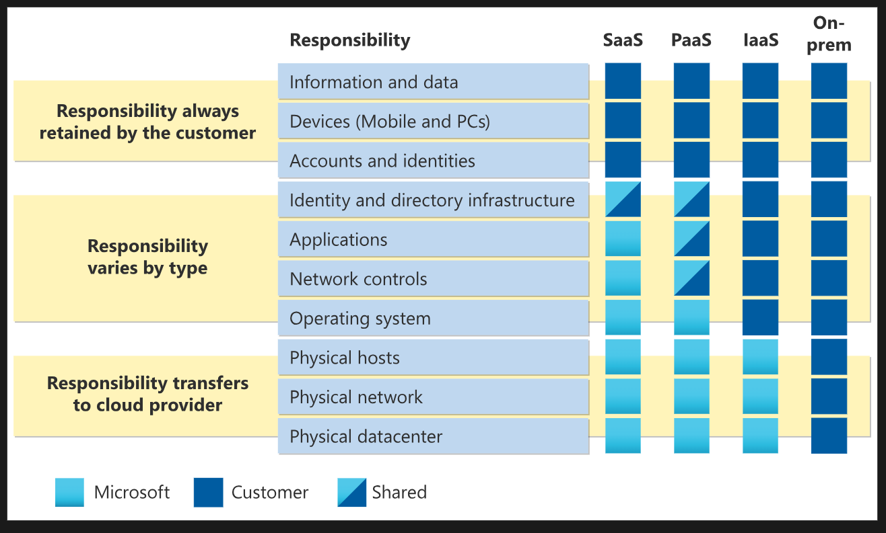

# ☁️ Module 01: Cloud Concepts

## 🔸 Overview

A high-level introduction to cloud computing, key benefits, and deployment models. This module helps you understand **what the cloud is**, **why it's valuable**, and **how it can be used**.

## 📘 Key Topics Covered

- Definition of Cloud Computing
- Benefits of Cloud Adoption
- Shared Responsibility Model
- Cloud Service Models (IaaS, PaaS, SaaS)
- Cloud Deployment Models (Public, Private, Hybrid)

## 📌 Core Concepts & Notes

### 1. What is Cloud Computing?

The delivery of computing services, including: compute, storage, networking, etc., over the Internet.

### 2. Benefits of Cloud Adoption

Cloud adoption allows organizations to shift from a Capital Expense to an Operational Expense model (**OpEx**).

| Benefit               | Description                                                            |
|-----------------------|------------------------------------------------------------------------|
| **High Availability** | **Uptime** 99% - 99.95%                                                |
| **Scalability**       | **Vertical** / **Horizontal** scaling as demand increases or decreases |
| **Reliability**       | **Recover** from failures (fault tolerance / DR)                       |
| **Predictability**    |  **Of performance**: resources needed   **Of cost**: forecasting    |
| **Agility**           | **Rapid** provisioning and innovation                                  |
| **Cost Efficiency**   | Reduced capital expense, **operational savings**                       |

### 3. Shared Responsibility Model

#### User is always responsible for

- Information and data stored in the cloud
- Devices allowed to connect to your cloud infrastructure
- Accounts and identities of the people, services, and devices within your organization

#### Cloud provider is always responsible for

- The physical datacenter, network, and hosts.

#### Shared responsibilities depending on service model

- OS
- Network controls
- Applications
- Identities and directory infrastructure

#### Management OF the Cloud

How you manage your cloud resources in terms of: scaling, deployment, monitoring, and alerting.

#### Management IN the cloud

Using what: Portal, CLI, APIs, Cloud Shell (Bash = CLI or PoweShell).

### 4. Cloud Service Models

| Model | Example Resources              | Example Scenarios |
|-------|--------------------------------|-----------------------------------------------------------------------------------------------------|
| IaaS  | VMs, VNets, storage            | - Lift-and-shift migration from on-prem to cloud   - Testing and development with full control   |
| PaaS  | App hosting, DB services       | - Use development frameworks and built-in components   - Analytics or business intelligence apps |
| SaaS  | Email, CRM, productivity tools | - Hosted Apps                                                                                       |

### 5. Cloud Deployment Models

| Model   | Definition                            | Example                          |
|---------|---------------------------------------|----------------------------------|
| Public  | Accessible via public Internet        | Microsoft Azure / AWS            |
| Private | Hosted on private infrastructure      | On-premises data center          |
| Hybrid  | Combines public and private           | Cloud backup + on-prem DB        |
