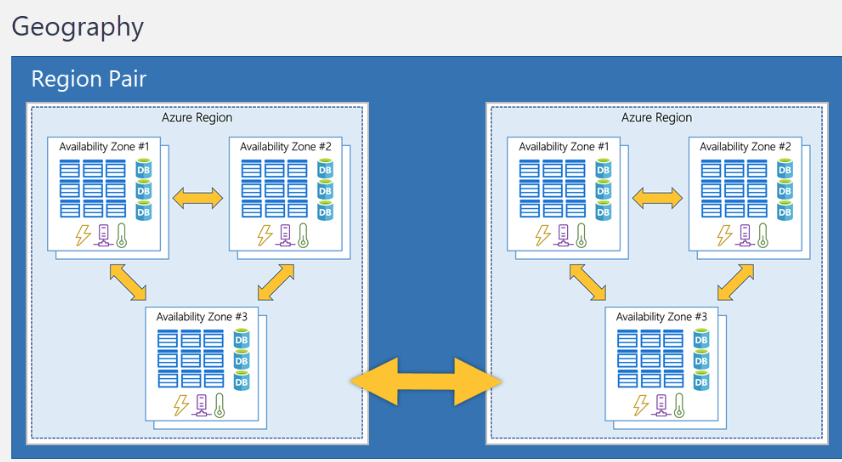

# ☁️ Module 02: Core Architectural Components

## 🔸 Physical Infrastructure

- **Geographies**: Grouped regions for data residency
  - **Region Pairs**: Two linked regions within the same geography, at least 300 miles away for disaster recovery and failover
    - **Regions**: Physical locations composed of **three or more availability zones** (if enabled), for hosting services
      - **Availability Zones**: Independent datacenters within a region, designed for redundancy and high availability

## 🎛️ Management Infrastructure

- **Management group**: organization of subscriptions into containers at scope level
  - **Subscription**: unit of management for billing and scaling  
  -**Billing boundary**: multiple subscriptions for different types of billing requirements  
  -**Access control boundary**: access management policies
    - **Resource group**: grouping of resources (can't be nested)
      - **Resource**: basic building block of Azure (everything)

### Hierarchy Limits and Constraints

- Maximum 10000 management groups per directory
- Maximum six levels of depth (not including root and subscription level)
- Each management group and subscription can only have one parent

### Reminder

Not all services auto-replicate data or fallbacks, so recovery and replication must be configured by the customer.
