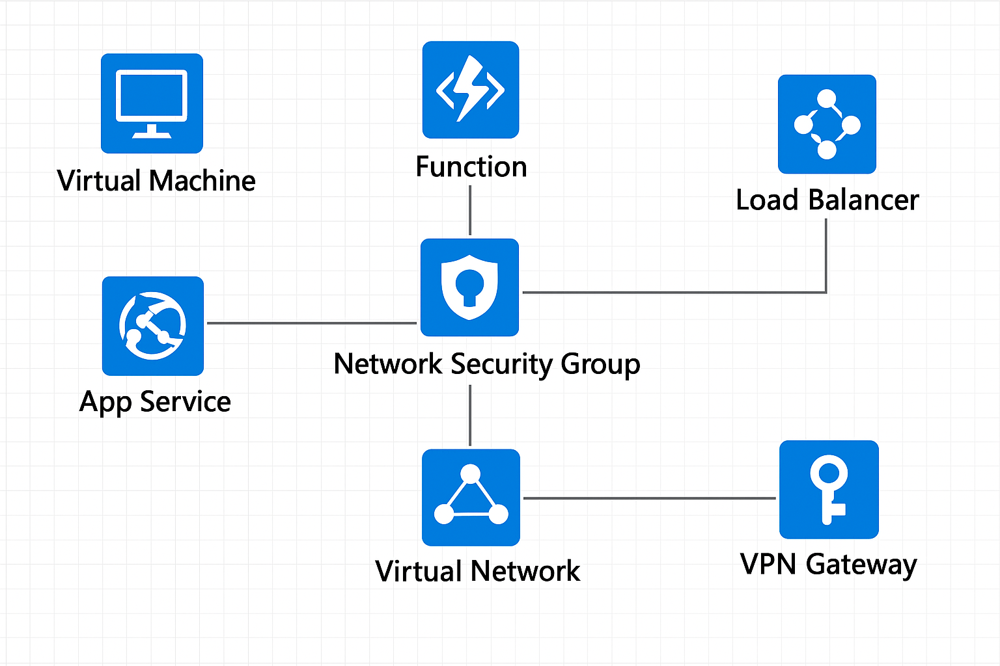

# ☁️ Module 02: Compute and Networking

## 🔸 Overview

On-demand computing that provides resources and connectivity.

## 🗝️ Key Compute Services

### 🖥️ Virtual Machines (VMs)

- Type: **IaaS**
- **Scale Sets**:
  - To scale resources elastically (based on demand or schedule)
  - Identical VMs that auto-deploy a load balancer
- **Availability Sets**
  - To create redundancies in order to prevent outages or handle updates
  - **Update Domain**: same-time rebooting
  - **Fault Domain**: power source and network switch

### 🌐 Azure Virtual Desktop

- Type: **IaaS**
- User hardware desktops with Entra ID.

### 🐳 Containers

- Type: **PaaS**
- **Azure Container Apps**: incorporates scaling and load balancing
- **Azure Kubernetes Service**: orchestration service

### ⚡ Azure Functions

- Type: **Serverless**
- Event-driven, serverless computing. Billed per invocation

### 🌐 Azure App Service

- Type: **PaaS**
- HTTP-based service to build and host in conjunction with scaling and high availability
- Enables automated deployments

## 🗝️ Key Networking Components

### Azure Virtual Network (VNet)

Enables Azure resources to communicate with each other and with on-prem resources privately using **Network Security Groups (NSGs)**, which enforce traffic filtering and access rules.

### Azure Virtual Private Networks

Securely connect two or more trusted private networks to one another over the public Internet.

### Azure VPN Gateway

Instances that are deployed in a **dedicated subnet** of the VNet. It supports the following scenarios:

#### Connection Types

| Connection Type | Description |
|-----------------|-------------|
| **Site-to-Site** | On-prem datacenters to VNets |
| **Point-to-Site** | Individual devices to VNets |
| **Network-to-Network** | VNets to other VNets |

#### VPN Types

| VPN Type         | Description                                                                    | Best Used When                                     |
|------------------|--------------------------------------------------------------------------------|----------------------------------------------------|
| **Policy-based** | Uses static routing policies to define packet encryption rules for each tunnel | Simple configurations, limited flexibility         |
| **Route-based**  | Uses dynamic routing with virtual tunnel interfaces (VTI)                      | VNets ↔ VNets   Point-to-Site ↔ Point-to-Site   Multi-Site ↔ Multi-Site   Using ExpressRoute gateway   More scalable and flexible scenarios |

### Azure ExpressRoute

Allow a private connection between on-prem networks and Azure.

### Azure DNS

Hosting service for DNS domains that provides name resolution.

#### AI-Generated Compute and Networking diagram

