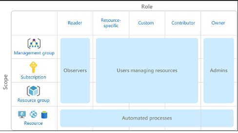

# ☁️ Module 02: Identity, Access and Security

## 📌 Core Concepts

### Authentication

Verifies identity — proves **who you are**.

### Authorization

Grants level of access or permissions — defines **what you can do** once authenticated.

### Azure Directory Services

- Microsoft Entra ID:
  - Authentication
  - SSO
  - App management
  - Device management

- Microsoft Entra Domain Services: set up by creating a domain namespace and deploying two Windows Server domain controllers
  - Domain join
  - Group policy
  - LDAP
  - Kerberos / NTLM authentication

### SSO

Sign in once and reuse credentials to access multiple apps and resources from different providers.

### Microsoft Entra Multifactor Authentication (MFA)

Service that provides authentication by requiring multiple verification factors:
  
- 🧠 Something you know (password, PIN)
- 📱 Something you have (device, token)
- 🧬 Something you are (biometric)

### B2B

Enables external users to access your company's apps and services.

### B2C

Lets customers sign in using their preferred social accounts.

### Windows Hello for Business

Uses biometrics or PIN as credentials.

### Microsoft Authenticator App

Enables passwordless login via mobile.

### FIDO2 Security Keys

Open standard for passwordless authentication using hardware devices (USB, Bluetooth, NFC).

### Conditional Access

Evaluates signals (like location, device, risk level) to decide whether to **grant, challenge, or block** access from a resource.

### Role-Based Access Control (RBAC)

- Assigns specific permissions to users or groups at **scope** level, which is a resource or set of resources this access applies to
- Hierarchical
- Enforced through **Azure Resource Manager**
- Least privilege: access is denied unless explicitly assigned

### Zero Trust Model

- Worst-case scenario assumption
- Verification explicitly required
- Least privilege access
- Access granted based on authentication, rather than location

### Defense-in-depth

Multi-layered approach to secure data from unauthorized access.

Layers:

- **Physical**: secure access to buildings and computing hardware
- **Identity and access**: ensure that identities are secure, access granted only to what's needed, and that sign-in events and changes are logged
- **Perimeter**: protects from network-based attacks
- **Network**: only allow what's required (deny / restrict as needed)
- **Compute**: compute resources are secure (VMs, endpoints)
- **Application**: proper app secrets storage and requirements around security
- **Data**: ensure confidentiality, integrity, and availability of it

### Microsoft Defender for Cloud

Tool for security posture management and threat protection.

- Deploys **Log Analytics**
- Helps **Azure Arc** on non-Azure machines (CSPM)
- Detects threats across: PaaS, data services and networks
- Assess ➝ Secure ➝ Defend ➝ Alert lifecycle
